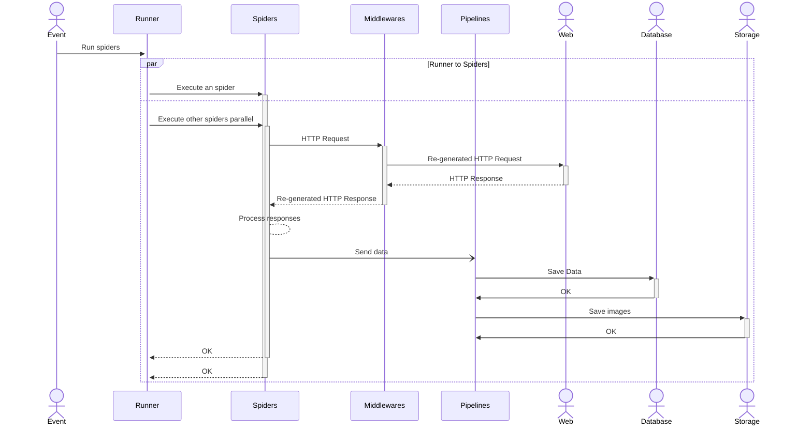

# Pyoniverse Crawler
## Flowchart

- Scrapy Framework에서 제공하는 Architecture를 동일하게 적용함
- Middlewares를 통해 Random UA 등의 요청을 함으로써 Banned 시간을 늦춤
- Pipelines를 통해 이미지 저장, 데이터 검증, 데이터 저장 등을 수행
- Runners를 통해 배치 실행
